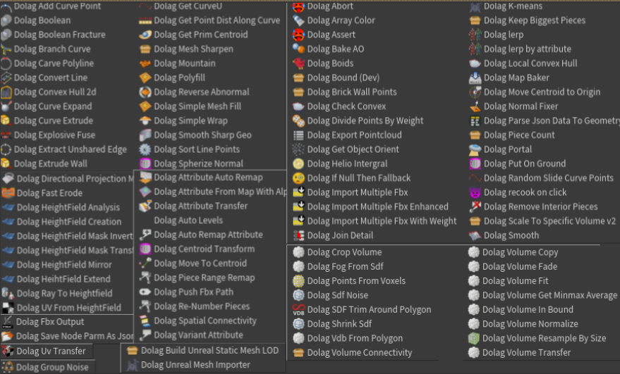
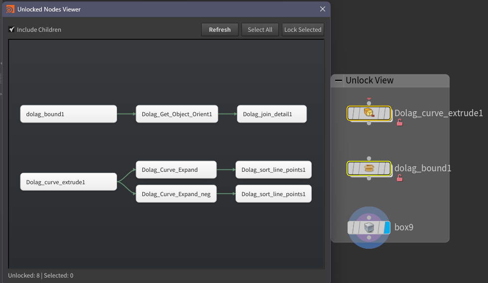
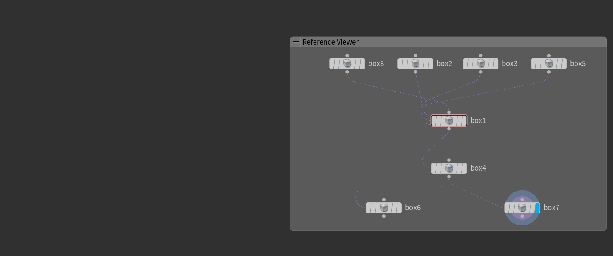

# Dolag-Houdini-Toolset

[](#简介) [](#introduction)

## 简介

一款功能强大的Houdini工具集，为您带来海量实用SOP节点、无缝的菜单功能扩展以及高效的快捷命令。适用于Houdini18.5及以上版本。

> **提示**：此工具集以**MIT**协议进行开源，由于使用了SideFX的Game Development Toolset的部分节点，因此在协议上添加了SideFX的协议内容，因此如果使用了本开源仓库的内容，请将SideFX的协议内容添加到您的协议中。[此处](https://github.com/dolag233/Doalg-Houdini-Toolset/)为github仓库链接，欢迎进行贡献😘。

[功能概览](#功能概览) | [效果演示](#效果演示) | [安装方法](#安装方法) | [使用文档](#使用文档)

---

## 功能概览

- **100+ 实用HDA**：提供海量SOP HDA，涵盖建模、虚幻引擎、体积、高度场等多个模块，专为程序化生成设计，同时又包含许多通用功能。所有节点均**无外部依赖**，可直接通过unlock的方式嵌入。
  
    所有节点均可在Tab菜单的 `Dolag` 分类下找到。

<p align="center">
  
  
</p>

- **快捷控制台**：在网络编辑器（Network Editor）面板中，按下`Ctrl+空格`即可唤出一个快速搜索列表，允许用户通过关键词搜索并执行指令。

<p align="center">
  
</p>

- **增强菜单功能**：
    1. **扩充右键菜单**：包含节点右键菜单和变量右键菜单。部分功能包括：
        - 一键整理节点布局。
        
        - 保存与加载节点参数。
        
        - 一键设置Ramp参数的插值方式，并支持细分、随机、平滑等操作。
        
        - 复制与粘贴节点样式。
        
        - 递归解锁当前节点内的所有子节点。

        - 递归查找unlock的节点。
        
        <p align="center">
          
        </p>
        
        - **显示节点引用关系**。
        <p align="center">
          
        </p>
        
    2. **主菜单功能**：在Houdini主菜单中添加了实用功能，如增量保存、为内置Python自动**安装pip**及通过pip**安装模块**等。
    
- **节点编辑器增强**：

    **移动和复制节点连接线**：按住`Ctrl+Alt`或`Shift+Ctrl`并拖动节点连接线，可以移动或复制它们，体验类似于在Unreal Engine中按住`Ctrl`键操作连接线。

<p align="center">
  
</p>

## 安装方法

0. **安装SideFX Labs**：许多节点依赖于Labs插件，请确保已安装。本工具集未内嵌相关节点。
   
1. 在 `C:\Users\你的用户名\Documents\houdiniX.Y` 目录下，使用Git克隆本仓库至 `DolagPlugin` 文件夹：

   ```bash
   git clone https://github.com/dolag233/Dolag-Houdini-Toolset.git DolagPlugin
   ```
   
2. 将 `DolagPlugin` 文件夹下的 `DolagPlugin.json` 文件复制到 `C:\Users\你的用户名\Documents\houdiniX.Y\packages` 目录下。如果 `packages` 目录不存在，请先创建它。

## 使用文档

详细使用方法请参见[在线文档](https://www.vis.dolag.work/houdini-toolset/%E7%AE%80%E4%BB%8B.html)。

## 路线图

- [ ] 支持保存用户设置
- [ ] 支持复制递归引用节点(用于SubNetwork)
- [ ] 支持快速拷贝参数引用
- [x] 支持递归查找、同步解锁的节点

---
<br>

## Introduction

A powerful Houdini toolset that brings you a massive number of practical SOP nodes, seamless menu function extensions, and efficient shortcut commands. Compatible with Houdini 18.5 and above.

> **Notice**: This toolset is open-sourced under the **MIT** license. Since it uses some nodes from SideFX's Game Development Toolset, the SideFX license content has been added to the agreement. Therefore, if you use content from this open-source repository, please add SideFX's license content to your license. [Here](https://github.com/dolag233/Doalg-Houdini-Toolset/) is the GitHub repository link, contributions are welcome 😘.

[Features](#features) | [Demos](#demos) | [Installation](#installation) | [Usage](#usage)

---

## <a name="features"></a>Features

- **100+ Practical SOP HDAs**: Provides a massive collection of SOP HDAs covering modules like modeling, Unreal Engine, volumes, and height fields, specifically designed for procedural generation while including many general-purpose functionalities. All nodes have **no external dependencies** and can be embedded directly through unlock.

    All nodes can be found under the `Dolag` category in the Tab menu.

<p align="center">
  
  
</p>

- **Quick Console**: In the Network Editor pane, press `Ctrl+Space` to bring up a quick search list, allowing users to find and execute commands via keywords.

<p align="center">
  
</p>

- **Enhanced Menu Functions**:
    1. **Extended Right-Click Menu**: Includes node right-click menu and parameter right-click menu. Key features include:
        - One-click node layout arrangement.
        
        - Save and load node parameters.
        
        - One-click setting of interpolation modes for Ramp parameters, with support for subdivision, randomization, and smoothing.
        
        - Copy and paste node styles.
        
        - Recursively unlock all child nodes within the current node.

        - Recursively find unlocked nodes.
        
        <p align="center">
          
        </p>
        
        - **Display node reference relationships**.
        <p align="center">
          
        </p>

    2. **Main Menu Functions**: Adds useful features to Houdini's main menu, such as incremental saving, and tools to automatically **install pip** for the built-in Python and **install modules** via pip.

- **Node Editor Enhancements**:

    **Move and Copy Node Wires**: Hold `Ctrl+Alt` or `Shift+Ctrl` while dragging node wires to move or copy them, similar to the experience of holding the `Ctrl` key in Unreal Engine to manage connections.

<p align="center">
  
</p>

## <a name="demos"></a>Demos

**HDA Showcase**
<p align="center">
  
</p>

**Connection Swapper**
<p align="center">
  
</p>

**Quick Console**
<p align="center">
  
</p>

**Node Reference Relationship Viewer**
<p align="center">
  
</p>

**Unlock Node Viewer**
<p align="center">
  
</p>

## <a name="installation"></a>Installation

0. **Install SideFX Labs**: Many nodes depend on the Labs plugin, so please ensure it is installed. This toolset does not embed the required Labs nodes.
   
1. In your `C:\Users\YourUsername\Documents\houdiniX.Y` directory, clone this repository into a folder named `DolagPlugin` using Git:

   ```bash
   git clone https://github.com/dolag233/Dolag-Houdini-Toolset.git DolagPlugin
   ```
   
2. Copy the `DolagPlugin.json` file from the `DolagPlugin` folder to the `C:\Users\YourUsername\Documents\houdiniX.Y\packages` directory. If the `packages` directory does not exist, please create it first.

## <a name="usage"></a>Usage

For detailed usage instructions, please refer to the [online documentation](https://www.vis.dolag.work/houdini-toolset/%E7%AE%80%E4%BB%8B.html).

## Roadmap

- [ ] Support for saving user settings
- [ ] Support for copying recursive reference nodes (for SubNetwork)
- [ ] Support for quick parameter reference copying
- [x] Support for recursively finding and synchronizing unlocked nodes