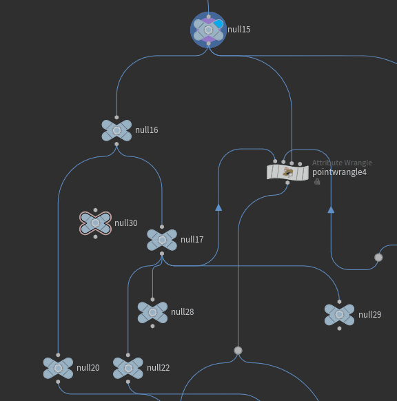
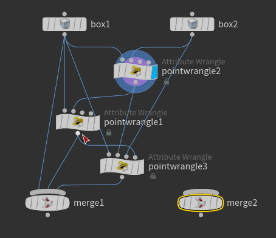

# Doalg-Houdini-Toolset

Dolag的Houdini工具集。

使用python2版本的Houdini 18.5以及python3版本的Houdini 19.5进行开发，目前应该兼容python2和3大版本。

## 目录

[功能概览](#功能概览)

[安装配置](#安装配置)

[使用方法](#使用方法)

---

## 功能概览

+ **海量Houdini节点**。提供了大量的Houdini资产，默认全局安装，可以直接作为节点在Houdini中进行使用。所有节点在HoudiniTab菜单中的“Dolag”分类下。

- **快捷控制台**。在Network Editor面板上，按下**Ctrl+空格键**后会召唤出一个快速搜索列表，用户可以通过关键词、首字母缩写、自定义的别名来进行搜索。用户选中列表中的某一项后，会执行对应的命令——例如说你可以应用"Heightfield"命令来创建HeightField节点，应用"Open Spreadsheet"命令会显示选中节点的几何属性——这些命令可以由用户**完全自定义**。

- **菜单功能扩展**。
    1. **扩充右键菜单**功能，包含**节点右键菜单**和**变量右键菜单**。扩充的功能会出现在右键菜单的“Dolag”分类下。例如在一个按钮类型变量处右键，会出现Dolag>Copy Button的扩展功能。 一些重要的扩展功能如下：
        - 一键对节点进行整理，进行垂直排列、垂直压缩。
        - 使用**VSCode**打开**Vex**和**Python**代码。
        - 提供用于快速**跳转**的节点，**双击**节点后可以跳转到设定的位置。
        - 复制粘贴按钮变量。让一个按钮在点击时同时触发其他拷贝按钮。
        - 保存和导入代码片段。保存当前代码文本框中的代码内容作为头文件&模块，以便以后导入。浏览和导入在搜索路径的头文件&模块。
        - 设置Ramp类型变量所有位置的插值方式；将Ramp进行细分、随机、平滑等处理。
        - 创建节点的引用。
        - 复制粘贴节点的形状、颜色；将节点设置为预设的形状颜色，用于快速区分节点的作用
        - 将节点、节点的变量值序列化为Json。
        - 一键整理节点。可对节点进行自动布局和空间压缩。
    2. **主菜单功能**。例如在主菜单的File下添加Save Incrementally(增量保存)功能，自动为python**安装pip**、使用pip进行**模块安装**等。

- **扩展节点编辑器功能**。

    1. **移动&复制节点连接**。按住Ctrl+Alt和Shift+Ctrl拖动节点连接，能够移动或复制节点连接，类似于在UE中按住Ctrl移动所有连接

- **代码库**。提供一些实用的vex和python代码库。

- **其他功能**。其他实用功能。

    1. AI Houdini Master。使用openai的接口实现的AI助手，能够帮你找到你想要的节点、帮你解决代码问题、其他Houdini相关问题。需要用户自己提供**OpenAI API Key**。

    ---

效果演示

+ 自动排列

+ 自动理线

+ 连接交换器

+ 快捷控制台

+ AI助手

  

+ 传送门

+ 自定义节点

+ 节点效果

## 安装配置

在使用前需要进行安装配置：

0. 需要安装SideFX Labs，因为很多节点都依赖于Labs的节点，且没有进行嵌入(Embedding)。

1. DolagPlugin.json文件放置到文档目录下对应版本的houdini文件夹下的packages文件夹中。

   例如，如果用户名为Dolag，且houdini版本号18.5，则将此文件放置到C:\Users\Dolag\Documents\houdini18.5\packages中。

2. 在文档下的对应版本houdini文件夹下新建DolagPlugin文件夹，并将剩余文件放置到此文件夹中。

   例如，如果用户名为Dolag，且houdini版本号为18.5，则将剩余文件放置到C:\Users\Dolag\Documents\houdini18.5\DolagPlugin中。

## 使用方法

使用方法参见[此处](https://www.vis.dolag.work/houdini-toolset/%E7%AE%80%E4%BB%8B.html)。

---

注：main分支为主分支，而dev分支以及dev分支下的分支(如otls分支)中进行新功能的开发，在新功能规模达到一定程度并验证后会进行合并，因此如要获取beta功能请关注dev分支以及dev分支下的分支。
